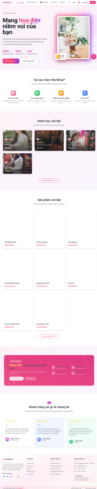
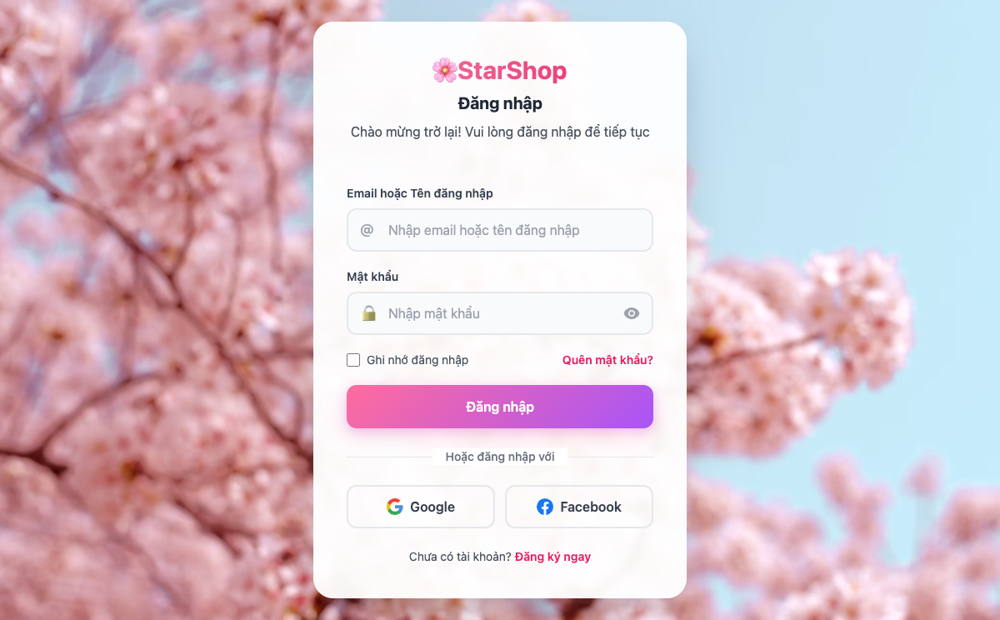
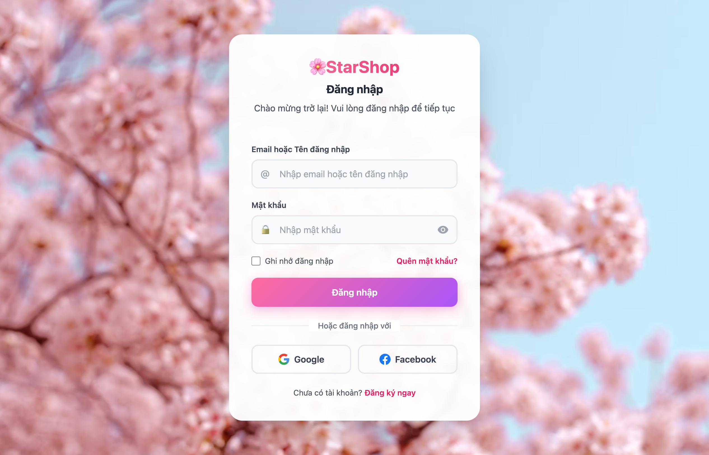
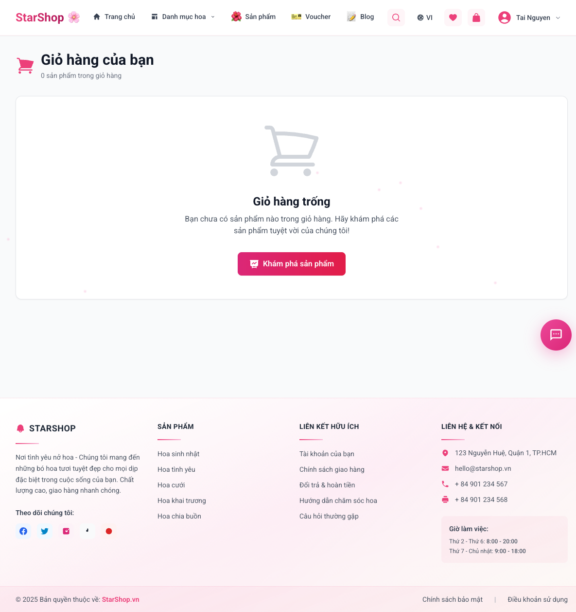
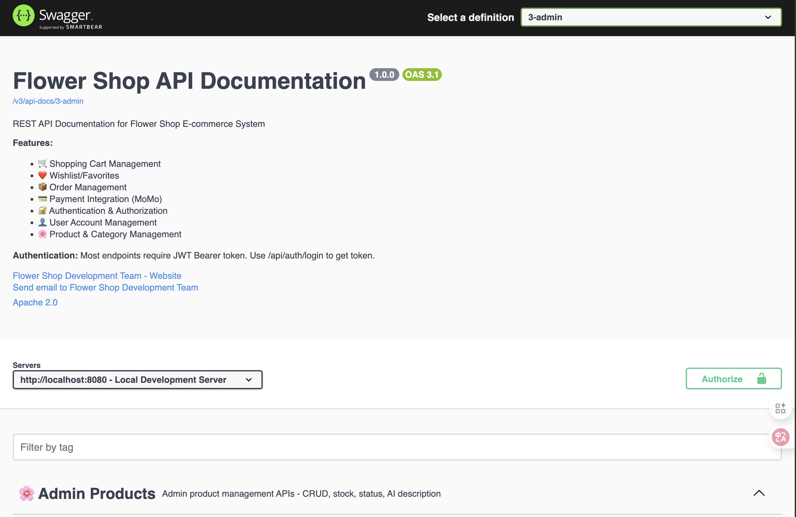

# 🌸 StarShop – Hệ thống Quản lý Cửa hàng Hoa trực tuyến

> **Nền tảng thương mại điện tử toàn diện** cho cửa hàng hoa với đầy đủ tính năng quản lý và bán hàng chuyên nghiệp. Tích hợp thanh toán MoMo, vận chuyển GHN, OAuth2, chat realtime với AI Assistant (Gemini), và hệ thống quản trị đa cấp độ (Admin/Staff/Customer).

---

## Nhóm thực hiện
- Vũ Toàn Thắng
- Nguyễn Nhật Huy
- Đặng Ngọc Tài
- Phan Quốc Viễn

---

## 📊 Công nghệ & Phiên bản


---

## 📚 Mục lục

- [📖 Giới thiệu](#-giới-thiệu)
- [🏗️ Kiến trúc & Stack công nghệ](#️-kiến-trúc--stack-công-nghệ)
- [✨ Tính năng chính](#-tính-năng-chính)
- [📸 Ảnh chụp màn hình](#-ảnh-chụp-màn-hình)
- [📁 Cấu trúc thư mục](#-cấu-trúc-thư-mục)
- [⚙️ Thiết lập & Chạy ứng dụng](#️-thiết-lập--chạy-ứng-dụng)
  - [Yêu cầu hệ thống](#yêu-cầu-hệ-thống)
  - [Chạy bằng Docker](#chạy-bằng-docker)
  - [Chạy Development](#chạy-development)
  - [Cấu hình môi trường](#cấu-hình-môi-trường)
- [🔌 Tích hợp bên ngoài](#-tích-hợp-bên-ngoài)
  - [GHN - Vận chuyển](#ghn---vận-chuyển)
  - [MoMo - Thanh toán](#momo---thanh-toán)
  - [Gemini AI - Chatbot](#gemini-ai---chatbot)
- [📝 Tài liệu API](#-tài-liệu-api)
- [🔒 Bảo mật & Triển khai](#-bảo-mật--triển-khai)
- [🔧 Khắc phục sự cố](#-khắc-phục-sự-cố)
- [📄 Giấy phép](#-giấy-phép)

---

## 📖 Giới thiệu

**StarShop** là hệ thống quản lý và bán hàng trực tuyến toàn diện dành cho cửa hàng hoa, được xây dựng trên nền tảng Spring Boot với kiến trúc MVC hiện đại.

### 🎯 Mục tiêu dự án
- **Trải nghiệm khách hàng tối ưu**: Giao diện thân thiện, quy trình đặt hàng nhanh chóng
- **Quản trị hiệu quả**: Dashboard phân quyền rõ ràng cho Admin/Staff với analytics chi tiết
- **Tích hợp dịch vụ Việt Nam**: GHN (vận chuyển), MoMo (thanh toán)
- **Hỗ trợ thông minh**: Chat realtime với AI Assistant (Google Gemini)
- **Bảo mật cao**: OAuth2, JWT, Spring Security với role-based access control

---

## 🏗️ Kiến trúc & Stack công nghệ

### Backend Framework
- **Spring Boot 3.5.5** - Framework chính
- **Spring MVC** - Web layer với pattern Controller-Service-Repository
- **Spring Data JPA** - ORM và database access
- **Spring Security** - Authentication & Authorization
- **Spring WebSocket** - Real-time communication
- **Server-Sent Events (SSE)** - Real-time updates

### Frontend & View
- **Thymeleaf** - Server-side template engine
- **Bootstrap 5** - Responsive UI framework
- **JavaScript/jQuery** - Client-side interactions
- **SockJS + STOMP** - WebSocket client

### Database
- **PostgreSQL 15** - Relational database
- **Docker Compose** - Database containerization
- **Flyway/SQL Scripts** - Schema initialization (`docker/init/*.sql`)

### Security & Authentication
- **Spring Security** - Core security framework
- **OAuth2 Client** - Google & Facebook login
- **JWT (JJWT 0.12.6)** - API authentication
- **BCrypt** - Password encryption

### External Integrations
- **Google Gemini AI** - AI chatbot assistant (gemini-2.5-flash)
- **MoMo Payment Gateway** - Online payment (test environment)
- **GHN API** - Shipping fee calculation & address management
- **SMTP** - Email notifications

### Documentation & Monitoring
- **Swagger/OpenAPI 3** - API documentation (springdoc 2.8.4)
- **Spring Boot Actuator** - Health checks & metrics
- **Logging** - SLF4J/Logback

### Build & Development Tools
- **Maven** - Dependency management & build tool
- **Lombok** - Reduce boilerplate code
- **Spring DevTools** - Hot reload for development
- **Apache POI** - Excel export functionality

### Package Structure
```
com.example.demo/
├── client/          # External API clients (GHN, Gemini)
├── config/          # Configuration classes
│   ├── SecurityConfig
│   ├── WebSocketConfig
│   ├── SwaggerConfig
│   └── Properties classes (MoMo, GHN, Gemini)
├── controller/      # REST & MVC controllers
│   ├── admin/      # Admin dashboard controllers
│   ├── staff/      # Staff dashboard controllers
│   └── api/        # REST API endpoints
├── dto/            # Data Transfer Objects
├── entity/         # JPA entities
├── repository/     # Spring Data repositories
├── service/        # Business logic layer
├── security/       # JWT filters & security utilities
├── scheduler/      # Scheduled tasks (payroll, etc.)
└── util/           # Helper utilities
```

---

## ✨ Tính năng chính

### 🔐 Xác thực & Bảo mật
- **Đăng nhập/Đăng ký** với email & password
- **OAuth2 Login** - Google và Facebook
- **JWT Authentication** cho REST API
- **Quên mật khẩu** với OTP qua email
- **Role-based Access Control** - 3 vai trò: CUSTOMER, STAFF, ADMIN
- **Session Management** - Bảo mật phiên làm việc

### 📦 Quản lý Sản phẩm & Danh mục
- **CRUD đầy đủ** - Thêm, sửa, xóa sản phẩm và danh mục
- **Upload hình ảnh** - Hỗ trợ nhiều ảnh cho mỗi sản phẩm
- **Tìm kiếm & Lọc** - Tìm kiếm theo tên, giá, danh mục
- **Đánh giá & Review** - Hệ thống đánh giá với AI sentiment analysis
- **Wishlist** - Danh sách yêu thích của khách hàng
- **AI Product Description** - Tự động tạo mô tả sản phẩm bằng AI
- **Quản lý tồn kho** - Theo dõi số lượng sản phẩm

### 🛒 Giỏ hàng & Đặt hàng
- **Giỏ hàng real-time** - Cập nhật tức thời
- **Checkout linh hoạt** - Hỗ trợ nhiều địa chỉ giao hàng
- **Hệ thống Voucher** - Mã giảm giá với điều kiện áp dụng
- **Theo dõi đơn hàng** - Cập nhật trạng thái realtime
- **Lịch sử đơn hàng** - Xem lại các đơn hàng đã đặt
- **Quản lý trạng thái** - PENDING, CONFIRMED, SHIPPING, DELIVERED, CANCELLED

### 🚚 Vận chuyển GHN
- **Tích hợp GHN API** - Giao Hàng Nhanh
- **Địa chỉ 2-3 cấp** - Tỉnh/Quận/Phường
- **Tính phí tự động** - Dựa trên khoảng cách và trọng lượng
- **Quản lý địa chỉ** - Lưu nhiều địa chỉ giao hàng
- **Cache thông minh** - Cache dữ liệu địa chỉ để tăng tốc

### 💳 Thanh toán
- **COD** - Thanh toán khi nhận hàng
- **MoMo** - Cổng thanh toán trực tuyến (test environment)
- **SSE Updates** - Cập nhật trạng thái thanh toán realtime
- **Webhook** - Xử lý callback từ MoMo tự động
- **Bảo mật** - Mã hóa và xác thực giao dịch

### 💬 Chat & AI Assistant
- **WebSocket Chat** - Trò chuyện realtime
- **AI Chatbot** - Google Gemini 2.5-flash
- **Tự động trả lời** - Hỗ trợ khách hàng 24/7
- **Handoff Queue** - Chuyển tiếp đến nhân viên khi cần
- **Lưu lịch sử** - Ghi lại toàn bộ cuộc hội thoại
- **PII Detection** - Bảo vệ thông tin cá nhân
- **Context Awareness** - Hiểu ngữ cảnh và lịch sử chat

### 📊 Dashboard Admin

#### Analytics & Báo cáo
- **Thống kê tổng quan** - Doanh thu, đơn hàng, khách hàng, sản phẩm
- **Biểu đồ tương quan** - Phân tích 7/30/90 ngày
- **Xu hướng doanh thu** - Biểu đồ revenue trend
- **Trạng thái đơn hàng** - Phân bố theo trạng thái
- **AI Insights** - Gợi ý và khuyến nghị tự động
- **Export Excel** - Xuất báo cáo chi tiết

#### Quản lý Kinh doanh
- **Đơn hàng** - CRUD, tìm kiếm, lọc, cập nhật trạng thái
- **Sản phẩm** - CRUD, upload ảnh, quản lý tồn kho, AI description
- **Danh mục** - CRUD catalogs và quản lý hình ảnh
- **Voucher** - Tạo mã giảm giá (PERCENTAGE/FIXED) với AI suggestions
- **Đánh giá** - Quản lý reviews, AI sentiment analysis, phản hồi

#### Quản lý Khách hàng
- **Danh sách khách hàng** - Xem, tìm kiếm, lọc
- **Phân khúc tự động** - VIP, NEW, AT_RISK (AI-powered)
- **Địa chỉ giao hàng** - Quản lý nhiều địa chỉ
- **Lịch sử mua hàng** - Theo dõi hoạt động khách hàng

#### Quản lý Nhân sự
- **Nhân viên** - CRUD, mã NV, chức vụ, phòng ban, lương/giờ
- **Chấm công** - Timesheet check-in/out, tổng hợp theo tháng
- **Tính lương** - Tự động tính lương (PENDING/PAID/OVERDUE)
- **Scheduler** - Tự động tính lương cuối tháng

#### Marketing & Nội dung
- **Chiến dịch Marketing** - Tạo campaign, gửi email hàng loạt
- **Segmentation** - Targeting theo nhóm khách hàng
- **Email Templates** - Quản lý mẫu email
- **Content Management** - Banner, hình ảnh, nội dung tĩnh

#### Hệ thống
- **Cài đặt** - Cấu hình chung hệ thống
- **Cache Management** - Quản lý cache hiệu quả
- **Health Check** - Giám sát tình trạng hệ thống

### 💼 Dashboard Staff

- **Xử lý Đơn hàng** - Quản lý đơn hàng được assigned
- **Chat Realtime** - Hỗ trợ khách hàng trực tiếp
- **Chấm công** - Check-in/check-out hàng ngày
- **Bảng lương** - Xem lương và thưởng cá nhân
- **Quản lý Review** - Phản hồi đánh giá khách hàng
- **Hiệu suất** - Theo dõi KPI cá nhân

### 🔧 Tính năng bổ sung

- **Email Notifications** - Gửi thông báo qua SMTP
- **Export Excel** - Xuất dữ liệu ra Excel (Apache POI)
- **API Documentation** - Swagger/OpenAPI 3.0
- **Rate Limiting** - Giới hạn tốc độ request
- **Intelligent Caching** - Cache địa chỉ, phí ship, gợi ý sản phẩm
- **Salary Scheduler** - Tự động tính lương theo giờ
- **Customer Segmentation** - AI phân loại khách hàng (VIP/NEW/AT_RISK)
- **AI Monitoring** - Giám sát và phân tích thông minh
- **Session Management** - Quản lý phiên an toàn
- **Health Checks** - Spring Boot Actuator monitoring

---

## 📸 Ảnh chụp màn hình

> Các giao diện chính của hệ thống StarShop

### Giao diện Khách hàng

| Trang chủ | Sản phẩm |
|:---:|:---:|
|  |  |

| Đăng nhập | Hồ sơ |
|:---:|:---:|
|  |  |

| Giỏ hàng | API Docs |
|:---:|:---:|
|  |  |

> **Lưu ý**: Để xem đầy đủ các giao diện Admin và Staff, vui lòng chạy ứng dụng và truy cập với quyền tương ứng.


---

## 📁 Cấu trúc thư mục

```text
demo_web/
├── src/
│   ├── main/
│   │   ├── java/com/example/demo/
│   │   │   ├── client/              # External API clients
│   │   │   │   ├── GhnClient.java   # Giao Hàng Nhanh API
│   │   │   │   └── GeminiClient.java # Google Gemini AI
│   │   │   ├── config/              # Configuration classes
│   │   │   │   ├── SecurityConfig.java
│   │   │   │   ├── WebSocketConfig.java
│   │   │   │   ├── SwaggerConfig.java
│   │   │   │   └── *Properties.java  # MoMo, GHN, Gemini configs
│   │   │   ├── controller/          # MVC & REST controllers
│   │   │   │   ├── admin/          # Admin dashboard
│   │   │   │   ├── staff/          # Staff dashboard
│   │   │   │   ├── api/            # REST API endpoints
│   │   │   │   └── ...             # Auth, Payment, Shipping, Chat
│   │   │   ├── dto/                 # Data Transfer Objects
│   │   │   ├── entity/              # JPA Entities
│   │   │   │   ├── User.java
│   │   │   │   ├── Product.java
│   │   │   │   ├── Order.java
│   │   │   │   ├── Conversation.java
│   │   │   │   └── ...
│   │   │   ├── repository/          # Spring Data JPA
│   │   │   ├── service/             # Business logic
│   │   │   ├── security/            # JWT & Security
│   │   │   ├── scheduler/           # Scheduled tasks
│   │   │   └── util/                # Helper utilities
│   │   └── resources/
│   │       ├── application.yml      # Main config
│   │       ├── application-dev.properties
│   │       ├── application-prod.properties
│   │       ├── templates/           # Thymeleaf templates
│   │       │   ├── admin/          # Admin views
│   │       │   ├── staff/          # Staff views
│   │       │   ├── customer/       # Customer views
│   │       │   └── layouts/        # Shared layouts
│   │       └── static/              # Static assets
│   │           ├── css/
│   │           ├── js/
│   │           └── images/
│   └── test/                    # Unit & Integration tests
├── docker/
│   └── init/                    # Database initialization
│       ├── 01-schema.sql
│       ├── 02-data.sql
│       └── ...
├── docs/
│   └── GHN_INTEGRATION.md       # GHN integration guide
├── assets/                      # Screenshots
├── docker-compose.yml           # PostgreSQL container
├── pom.xml                      # Maven dependencies
├── mvnw, mvnw.cmd               # Maven wrapper
├── .env.example                 # Environment variables template
└── README.md                    # This file
```

---

## ⚙️ Thiết lập & Chạy ứng dụng

### Yêu cầu hệ thống

- **Java Development Kit (JDK)** - Version 17 trở lên
- **Docker & Docker Compose** - Để chạy PostgreSQL
- **Maven** - Đã có sẵn Maven Wrapper (`mvnw`)
- **VS Code Dev Tunnels** - (Tùy chọn) Để test MoMo callback
- **Git** - Version control

### Chạy bằng Docker

#### 1. Khởi động PostgreSQL

```bash
# Clone repository
git clone <repository-url>
cd demo_web

# Khởi động PostgreSQL container
docker compose up -d
```

**Thông tin kết nối Database:**
- **URL**: `jdbc:postgresql://localhost:5432/flower_shop_system`
- **Username**: `flower_admin`
- **Password**: `flower_password_2024`
- **Port**: `5432`

> Database sẽ tự động khởi tạo schema và seed data từ `docker/init/*.sql`

#### 2. Kiểm tra Database

```bash
# Kiểm tra container đang chạy
docker compose ps

# Xem logs
docker compose logs -f
```

### Chạy Development

#### Phương án 1: Sử dụng Maven Wrapper (Khuyến nghị)

```bash
# Windows
.\mvnw.cmd spring-boot:run

# Linux/Mac
./mvnw spring-boot:run
```

#### Phương án 2: Sử dụng script dev

```bash
# Thiết lập VS Code Dev Tunnel (cho MoMo callback)
./dev-vscode.sh set-url
# Nhập URL: https://your-tunnel-url.app.github.dev

# Chạy ứng dụng
./dev-vscode.sh start
```

#### Phương án 3: Chạy từ IDE

1. Import project vào IDE (IntelliJ IDEA, Eclipse, VS Code)
2. Đợi Maven download dependencies
3. Chạy class `DemoApplication.java`

### Truy cập ứng dụng

- **Trang chủ**: http://localhost:8080
- **Swagger UI**: http://localhost:8080/swagger-ui.html
- **API Docs**: http://localhost:8080/v3/api-docs
- **Actuator**: http://localhost:8080/actuator

### Tài khoản mặc định

| Vai trò | Email | Password |
|---------|-------|----------|
| Admin | admin@starshop.com | admin123 |
| Staff | staff@starshop.com | staff123 |
| Customer | customer@starshop.com | customer123 |

> **Lưu ý**: Đổi mật khẩu ngay sau lần đăng nhập đầu tiên trong môi trường production!

---

### Cấu hình môi trường

#### 1. Copy file cấu hình mẫu

```bash
cp .env.example .env
```

#### 2. Cấu hình các biến môi trường

Chỉnh sửa file `.env` hoặc export trực tiếp:

```bash
# Database Configuration
export SPRING_DATASOURCE_URL=jdbc:postgresql://localhost:5432/flower_shop_system
export SPRING_DATASOURCE_USERNAME=flower_admin
export SPRING_DATASOURCE_PASSWORD=flower_password_2024

# GHN (Giao Hàng Nhanh) Configuration
export GHN_TOKEN=your_ghn_token_here
export GHN_SHOP_ID=your_shop_id
export GHN_FROM_PROVINCE_ID=202
export GHN_FROM_DISTRICT_ID=3695
export GHN_FROM_WARD_CODE=90745

# MoMo Payment Configuration
export MOMO_PARTNER_CODE=your_partner_code
export MOMO_ACCESS_KEY=your_access_key
export MOMO_SECRET_KEY=your_secret_key
export VSCODE_FORWARD_URL=https://your-tunnel-url.example

# Google Gemini AI Configuration
export GEMINI_API_KEY=your_gemini_api_key
export GEMINI_MODEL=gemini-2.5-flash

# OAuth2 Configuration
export SPRING_SECURITY_OAUTH2_CLIENT_REGISTRATION_GOOGLE_CLIENT_ID=your_google_client_id
export SPRING_SECURITY_OAUTH2_CLIENT_REGISTRATION_GOOGLE_CLIENT_SECRET=your_google_client_secret
export SPRING_SECURITY_OAUTH2_CLIENT_REGISTRATION_FACEBOOK_CLIENT_ID=your_facebook_client_id
export SPRING_SECURITY_OAUTH2_CLIENT_REGISTRATION_FACEBOOK_CLIENT_SECRET=your_facebook_client_secret

# SMTP Email Configuration
export SPRING_MAIL_HOST=smtp.gmail.com
export SPRING_MAIL_PORT=587
export SPRING_MAIL_USERNAME=your_email@gmail.com
export SPRING_MAIL_PASSWORD=your_app_password

# JWT Configuration
export JWT_SECRET=your_jwt_secret_key_here_minimum_256_bits
export JWT_EXPIRATION=86400000
```

#### 3. Profiles

Ứng dụng hỗ trợ nhiều profiles:

- **dev** - Development (mặc định)
- **prod** - Production

```bash
# Chạy với profile cụ thể
./mvnw spring-boot:run -Dspring-boot.run.profiles=prod
```

---

## 🔌 Tích hợp bên ngoài

### GHN - Vận chuyển

#### Đăng ký tài khoản GHN

1. Truy cập [GHN Developer](https://dev.ghn.vn/)
2. Đăng ký tài khoản và tạo shop
3. Lấy `Token` và `ShopID`

#### Cấu hình

```bash
export GHN_TOKEN=your_token_here
export GHN_SHOP_ID=your_shop_id
export GHN_FROM_PROVINCE_ID=202      # Hà Nội
export GHN_FROM_DISTRICT_ID=3695     # Quận Cầu Giấy
export GHN_FROM_WARD_CODE=90745      # Phường Dịch Vọng
```

#### API Endpoints

- `GET /api/locations/provinces` - Lấy danh sách tỉnh/thành
- `GET /api/locations/districts?provinceId={id}` - Lấy quận/huyện
- `GET /api/locations/wards?districtId={id}` - Lấy phường/xã
- `POST /api/shipping/fee` - Tính phí vận chuyển

#### Tài liệu chi tiết

Xem `docs/GHN_INTEGRATION.md` để biết thêm chi tiết về:
- Địa chỉ 2 cấp vs 3 cấp
- Caching strategy
- Error handling

### MoMo - Thanh toán

#### Đăng ký MoMo Test

1. Truy cập [MoMo Developer](https://developers.momo.vn/)
2. Đăng ký tài khoản test
3. Lấy `PartnerCode`, `AccessKey`, `SecretKey`

#### Cấu hình

```bash
export MOMO_PARTNER_CODE=your_partner_code
export MOMO_ACCESS_KEY=your_access_key
export MOMO_SECRET_KEY=your_secret_key
export VSCODE_FORWARD_URL=https://your-tunnel.app.github.dev
```

#### Thiết lập VS Code Dev Tunnel

```bash
# Cài đặt VS Code CLI
code tunnel

# Hoặc sử dụng script
./dev-vscode.sh set-url
```

#### API Endpoints

- `POST /payment/momo/create` - Tạo giao dịch
- `GET /payment/momo/return` - Return URL sau thanh toán
- `POST /payment/momo/notify` - Webhook callback
- `GET /sse/orders/{orderId}` - SSE real-time updates

#### Test thanh toán

1. Tạo đơn hàng và chọn thanh toán MoMo
2. Quét QR code hoặc dùng app MoMo test
3. Theo dõi trạng thái real-time qua SSE

### Gemini AI - Chatbot

#### Lấy API Key

1. Truy cập [Google AI Studio](https://makersuite.google.com/app/apikey)
2. Tạo API key mới
3. Copy và lưu vào biến môi trường

#### Cấu hình

```bash
export GEMINI_API_KEY=your_api_key_here
export GEMINI_MODEL=gemini-2.5-flash
export GEMINI_TEMPERATURE=0.5
export GEMINI_MAX_TOKENS=8192
```

#### Tính năng

- **AI Chatbot** - Trả lời tự động câu hỏi khách hàng
- **Product Description** - Tạo mô tả sản phẩm
- **Sentiment Analysis** - Phân tích đánh giá
- **Customer Segmentation** - Phân loại khách hàng
- **AI Insights** - Gợi ý kinh doanh

#### WebSocket Chat

```javascript
// Kết nối WebSocket
const socket = new SockJS('/ws');
const stompClient = Stomp.over(socket);

stompClient.connect({}, function(frame) {
    stompClient.subscribe('/user/queue/messages', function(message) {
        // Xử lý tin nhắn
    });
});
```

---

## 📝 Tài liệu API

### Swagger UI

Truy cập tài liệu API tương tác tại:

**URL**: http://localhost:8080/swagger-ui.html

### OpenAPI Specification

- **JSON**: http://localhost:8080/v3/api-docs
- **YAML**: http://localhost:8080/v3/api-docs.yaml

### Các API chính

#### Authentication
- `POST /api/auth/register` - Đăng ký tài khoản
- `POST /api/auth/login` - Đăng nhập
- `POST /api/auth/refresh` - Refresh token
- `POST /api/auth/forgot-password` - Quên mật khẩu

#### Products
- `GET /api/products` - Danh sách sản phẩm
- `GET /api/products/{id}` - Chi tiết sản phẩm
- `POST /api/products` - Tạo sản phẩm (Admin)
- `PUT /api/products/{id}` - Cập nhật sản phẩm (Admin)
- `DELETE /api/products/{id}` - Xóa sản phẩm (Admin)

#### Orders
- `GET /api/orders` - Danh sách đơn hàng
- `GET /api/orders/{id}` - Chi tiết đơn hàng
- `POST /api/orders` - Tạo đơn hàng
- `PUT /api/orders/{id}/status` - Cập nhật trạng thái

#### Cart
- `GET /api/cart` - Xem giỏ hàng
- `POST /api/cart/items` - Thêm vào giỏ
- `PUT /api/cart/items/{id}` - Cập nhật số lượng
- `DELETE /api/cart/items/{id}` - Xóa khỏi giỏ

### Authentication

API sử dụng JWT Bearer token:

```bash
curl -H "Authorization: Bearer YOUR_JWT_TOKEN" \
     http://localhost:8080/api/orders
```

---

## 🔒 Bảo mật & Triển khai

### Bảo mật

#### 1. Quản lý Secrets

**KHÔNG BAO GIỞ** commit secrets vào Git:

```bash
# Sử dụng biến môi trường
export SENSITIVE_KEY=value

# Hoặc Secret Manager (AWS, Azure, GCP)
# Hoặc Docker Secrets
# Hoặc Kubernetes Secrets
```

#### 2. HTTPS & SSL/TLS

```nginx
# Nginx reverse proxy
server {
    listen 443 ssl http2;
    server_name starshop.example.com;
    
    ssl_certificate /path/to/cert.pem;
    ssl_certificate_key /path/to/key.pem;
    
    location / {
        proxy_pass http://localhost:8080;
        proxy_set_header X-Forwarded-Proto https;
    }
}
```

#### 3. Cookie Security

```yaml
spring:
  servlet:
    session:
      cookie:
        secure: true          # Chỉ gửi qua HTTPS
        http-only: true       # Không truy cập từ JavaScript
        same-site: strict     # Chống CSRF
```

#### 4. Rate Limiting

Đã tích hợp rate limiting để chống DDoS và brute force.

#### 5. SQL Injection Prevention

Sử dụng JPA/Hibernate với prepared statements.

#### 6. XSS Prevention

Thymeleaf tự động escape HTML.

### Triển khai Production

#### Checklist trước khi deploy

- [ ] Đổi tất cả mật khẩu mặc định
- [ ] Cấu hình biến môi trường production
- [ ] Bật HTTPS và SSL/TLS
- [ ] Tắt Spring DevTools
- [ ] Đặt log level = WARN hoặc ERROR
- [ ] Cấu hình database backup tự động
- [ ] Thiết lập monitoring và alerting
- [ ] Kiểm tra firewall rules
- [ ] Cấu hình CORS chính xác
- [ ] Review Spring Security config

#### Docker Production

```dockerfile
# Dockerfile
FROM eclipse-temurin:17-jre-alpine
WORKDIR /app
COPY target/*.jar app.jar
EXPOSE 8080
ENTRYPOINT ["java", "-jar", "app.jar"]
```

```bash
# Build
./mvnw clean package -DskipTests
docker build -t starshop:latest .

# Run
docker run -d \
  -p 8080:8080 \
  --env-file .env.prod \
  --name starshop \
  starshop:latest
```

#### Kubernetes Deployment

```yaml
apiVersion: apps/v1
kind: Deployment
metadata:
  name: starshop
spec:
  replicas: 3
  selector:
    matchLabels:
      app: starshop
  template:
    metadata:
      labels:
        app: starshop
    spec:
      containers:
      - name: starshop
        image: starshop:latest
        ports:
        - containerPort: 8080
        envFrom:
        - secretRef:
            name: starshop-secrets
```

---

## 🔧 Khắc phục sự cố

### Database Issues

#### Lỗi kết nối PostgreSQL

```bash
# Kiểm tra container
docker compose ps

# Kiểm tra logs
docker compose logs postgres

# Restart container
docker compose restart postgres

# Kiểm tra port
netstat -an | grep 5432
```

**Nguyên nhân thường gặp:**
- Port 5432 đã bị sử dụng
- Sai thông tin đăng nhập
- Container chưa khởi động xong

#### Lỗi migration/schema

```bash
# Xóa và tạo lại database
docker compose down -v
docker compose up -d
```

### GHN Integration Issues

#### 401 Unauthorized

```bash
# Kiểm tra token
echo $GHN_TOKEN

# Test API trực tiếp
curl -H "Token: YOUR_TOKEN" \
     https://dev-online-gateway.ghn.vn/shiip/public-api/master-data/province
```

**Giải pháp:**
- Kiểm tra token còn hiệu lực
- Đảm bảo đúng `GHN_SHOP_ID`
- Kiểm tra IP whitelist (nếu có)

### MoMo Payment Issues

#### Webhook không nhận được

```bash
# Kiểm tra tunnel
echo $VSCODE_FORWARD_URL

# Test endpoint
curl https://your-tunnel-url/payment/momo/notify
```

**Giải pháp:**
- Kiểm tra VS Code tunnel còn hoạt động
- Đảm bảo URL là HTTPS
- Kiểm tra firewall/network

### OAuth2 Issues

#### Google/Facebook login không hoạt động

**Kiểm tra:**
1. Callback URL trong console: `http://localhost:8080/login/oauth2/code/google`
2. Client ID và Secret đúng
3. OAuth consent screen đã cấu hình

### WebSocket/SSE Issues

#### SSE không stream

```javascript
// Kiểm tra kết nối
const eventSource = new EventSource('/sse/orders/123');
eventSource.onerror = (error) => {
    console.error('SSE Error:', error);
};
```

**Giải pháp:**
- Kiểm tra CORS settings
- Đảm bảo không có proxy/CDN chặn SSE
- Kiểm tra timeout settings

### Performance Issues

#### Ứng dụng chạy chậm

```bash
# Kiểm tra memory
jps -lvm

# Tăng heap size
export JAVA_OPTS="-Xms512m -Xmx2048m"
./mvnw spring-boot:run
```

**Tối ưu hóa:**
- Bật cache cho GHN locations
- Sử dụng connection pooling
- Tối ưu query database
- Bật compression

### Logs & Debugging

```bash
# Xem logs
tail -f logs/app.log

# Tăng log level
export LOGGING_LEVEL_COM_EXAMPLE_DEMO=DEBUG

# Actuator health check
curl http://localhost:8080/actuator/health
```

---

## 📝 Liên hệ & Hỗ trợ

### Nhóm phát triển

- **Vũ Toàn Thắng** - Team Lead & Backend Developer
- **Nguyễn Nhật Huy** - Full-stack Developer
- **Đặng Ngọc Tài** - Backend Developer
- **Phan Quốc Viễn** - Frontend Developer

### Báo lỗi & Góp ý

Nếu bạn gặp lỗi hoặc có ý tưởng mới, vui lòng:
1. Tạo issue trên GitHub
2. Mô tả chi tiết vấn đề
3. Đính kèm logs và screenshots nếu có

### Đóng góp

Chúng tôi hoan nghênh mọi đóng góp! Vui lòng:
1. Fork repository
2. Tạo branch mới (`git checkout -b feature/AmazingFeature`)
3. Commit thay đổi (`git commit -m 'Add some AmazingFeature'`)
4. Push lên branch (`git push origin feature/AmazingFeature`)
5. Tạo Pull Request

---

## 📄 Giấy phép

Dự án này được phân phối dưới **MIT License**.

```
MIT License

Copyright (c) 2025 StarShop Team

Permission is hereby granted, free of charge, to any person obtaining a copy
of this software and associated documentation files (the "Software"), to deal
in the Software without restriction, including without limitation the rights
to use, copy, modify, merge, publish, distribute, sublicense, and/or sell
copies of the Software, and to permit persons to whom the Software is
furnished to do so, subject to the following conditions:

The above copyright notice and this permission notice shall be included in all
copies or substantial portions of the Software.

THE SOFTWARE IS PROVIDED "AS IS", WITHOUT WARRANTY OF ANY KIND, EXPRESS OR
IMPLIED, INCLUDING BUT NOT LIMITED TO THE WARRANTIES OF MERCHANTABILITY,
FITNESS FOR A PARTICULAR PURPOSE AND NONINFRINGEMENT. IN NO EVENT SHALL THE
AUTHORS OR COPYRIGHT HOLDERS BE LIABLE FOR ANY CLAIM, DAMAGES OR OTHER
LIABILITY, WHETHER IN AN ACTION OF CONTRACT, TORT OR OTHERWISE, ARISING FROM,
OUT OF OR IN CONNECTION WITH THE SOFTWARE OR THE USE OR OTHER DEALINGS IN THE
SOFTWARE.
```

Xem file [LICENSE](LICENSE) để biết thêm chi tiết.

---

## 🌐 English Summary

**StarShop** is a comprehensive e-commerce platform built with Spring Boot for flower shop management and online sales.

### Key Features
- **Authentication**: OAuth2 (Google/Facebook), JWT, OTP password recovery
- **Product Management**: Full CRUD with AI-powered descriptions
- **Order Processing**: Real-time cart, checkout, order tracking
- **Payment Integration**: MoMo payment gateway with SSE updates
- **Shipping**: GHN (Giao Hang Nhanh) API integration
- **AI Assistant**: Google Gemini-powered chatbot with WebSocket
- **Admin Dashboard**: Analytics, reports, customer segmentation
- **Staff Portal**: Order management, timesheet, payroll

### Tech Stack
- **Backend**: Spring Boot 3.5.5, Spring Security, Spring Data JPA
- **Frontend**: Thymeleaf, Bootstrap 5, JavaScript
- **Database**: PostgreSQL 15
- **AI**: Google Gemini 2.5-flash
- **Documentation**: Swagger/OpenAPI 3.0
- **Deployment**: Docker, Docker Compose

### Quick Start
```bash
# Start PostgreSQL
docker compose up -d

# Run application
./mvnw spring-boot:run

# Access at http://localhost:8080
```

**Note**: Configure all secrets via environment variables in production.

---

<div align="center">

**⭐ Nếu bạn thấy dự án hữu ích, hãy cho chúng tôi một star! ⭐**

**Copyright © 2025 StarShop Team. All rights reserved.**

</div>

---


